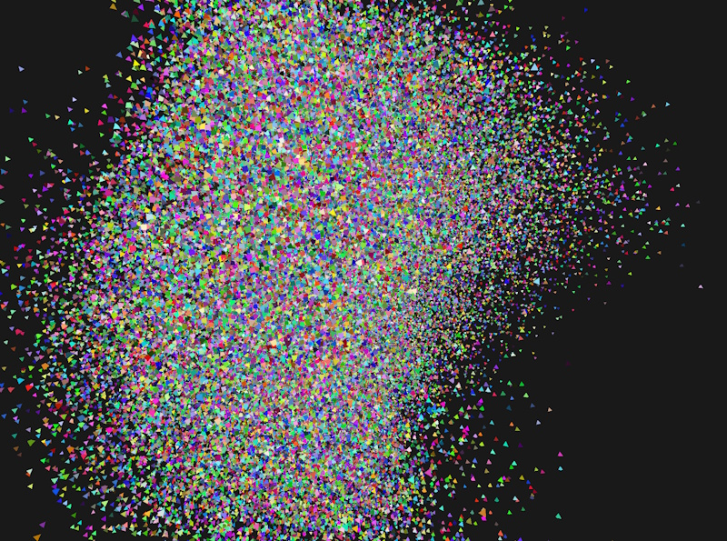
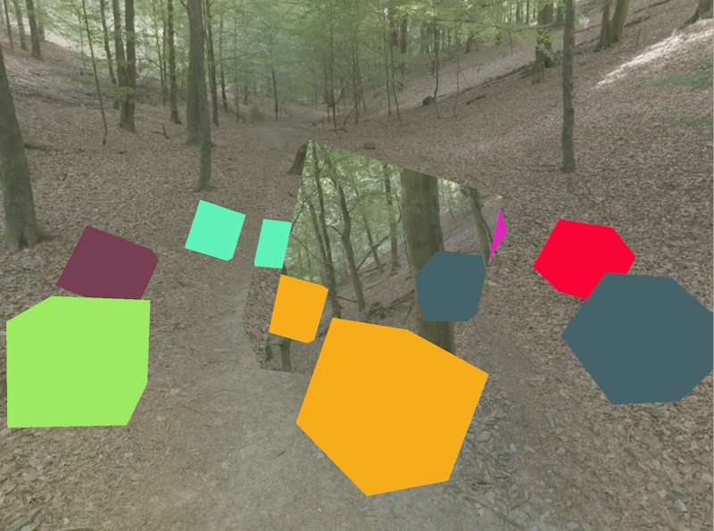
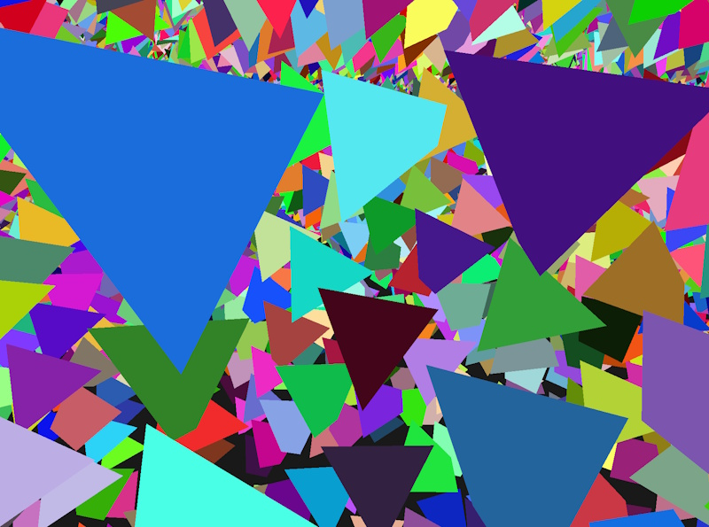

Welcome to **LiteFX** – a modern, flexible computer graphics and rendering engine, written in C++23 with support for Vulkan and DirectX 12.
It contains an abstraction layer over both graphics APIs that allows for seamless switching between them, without re-creating the application
window. The engine can be configured through a fluent builder interface, making it easy to express render pipeline configurations quickly. It
uses [CMake](https://cmake.org/) and [vcpkg](https://vcpkg.io/) to manage dependencies and is straightforward to build. Custom shader targets
(written in HLSL or GLSL) allow you to set up a basic, fully featured rendering application within seconds.

## Designed to make modern graphics APIs accessible { .lfx-section-title }

-   :material-lightbulb-on-outline:{ .lg .middle } __State of the art__

    ---

    LiteFX supports many state-of-the-art features of modern graphics APIs, such as **mesh shaders**, **ray tracing** and **indirect draw**.
    It utilizes features and extensions from the *DirectX 12 Agility SDK* and *Vulkan 1.3* for a better user experience, such as
    **enhanced barriers** and **dynamic rendering**.

-   :material-cogs:{ .lg .middle } __Streamlined API__

    ---

    A streamlined, object-oriented API allows for straightforward state management and quickly setting up render graphs. The optional fluent
    **builder API** configures pipelines, shaders and render passes, and **shader reflection** derives pipeline interfaces from shader
    programs.

-   :material-hammer-wrench:{ .lg .middle } __CMake integration__

    ---

    Tools to integrate *assets* and *shaders* into your build process let you manage them next to your sources, without leaving your IDE.
    Shaders can be authored in *GLSL* and *HLSL* and can target both supported APIs from a single source.

## With support for state-of-the-art rendering techniques { .lfx-section-title }

{ loading=lazy }

### Bindless rendering

LiteFX supports **descriptor indexing** in unbounded descriptor arrays, which enables bindless rendering techniques. Using those, it is
straightforward to put object or material information in a common buffer and pass the non-uniform index as part of a push constant, instance
index or any other means to the GPU. This makes managing large dynamic scenes accessible. LiteFX takes care of managing the descriptors, so that
you can work with the same interface on both sides: in your shaders as well as your application.

{ loading=lazy }

### Hardware ray tracing

The engine provides an abstraction layer over hardware-accelerated ray tracing workflows, including traditional **ray tracing pipelines**,
**inline ray tracing and ray queries**, as well as managing and compacting **acceleration structures**. As with the other features, LiteFX is
agnostic with regards to the graphics API you want to use: set up rendering once and switch between backends at run-time.

{ loading=lazy }

### Indirect rendering

Some workloads differ vastly between graphics APIs. One such example is **indirect rendering**. LiteFX provides a comprehensive abstraction for
it, using shader model 6.8 to resolve fundamental architectural differences. This makes it easy to write portable applications that execute on
different graphics backends based on the same code base.

… and there's more! Check out the [samples on GitHub](https://github.com/crud89/LiteFX/tree/main/src/Samples/).

[Get started :material-arrow-right:](getting-started/index.md){ .md-button .md-button--primary }
[API reference :material-book-open-variant:](api/index.md){ .md-button }

